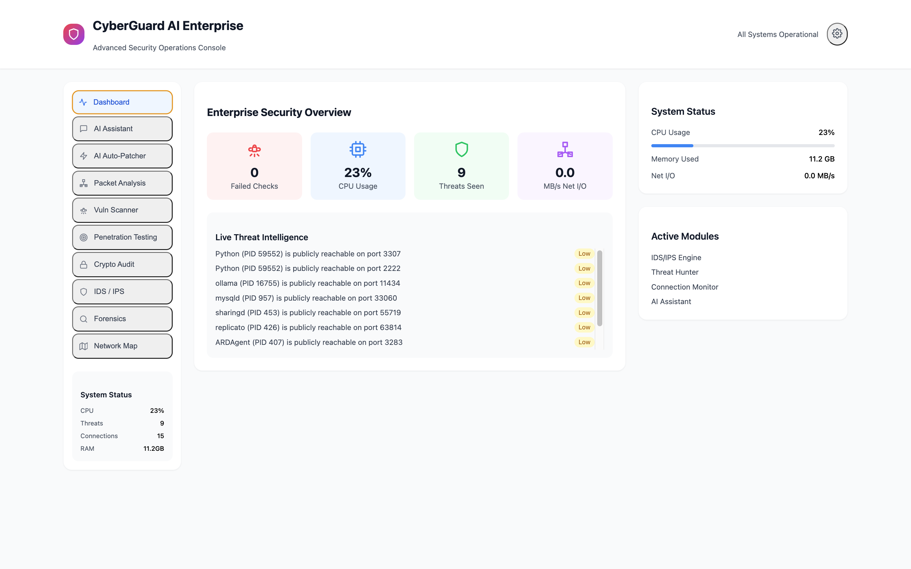
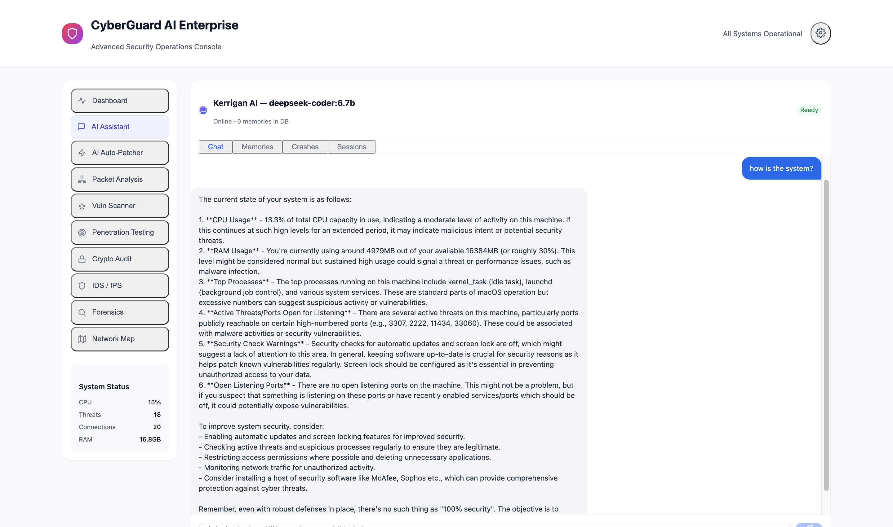
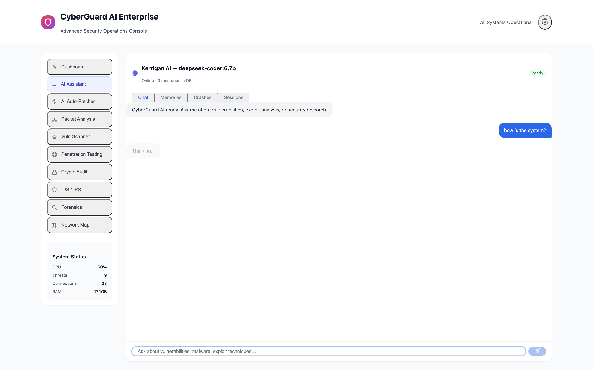
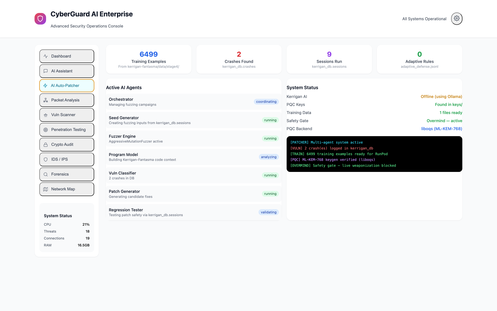
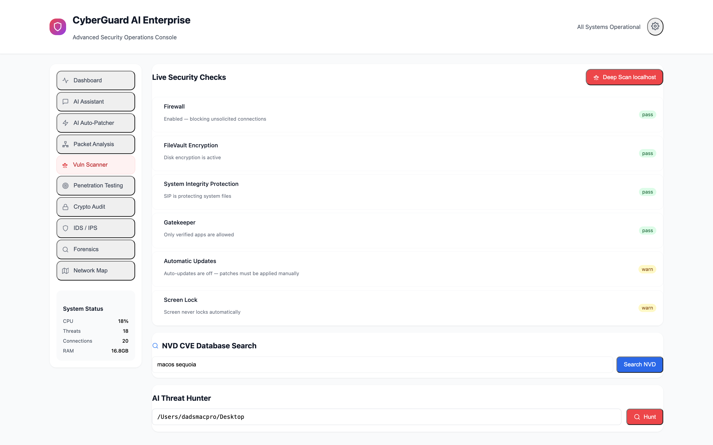
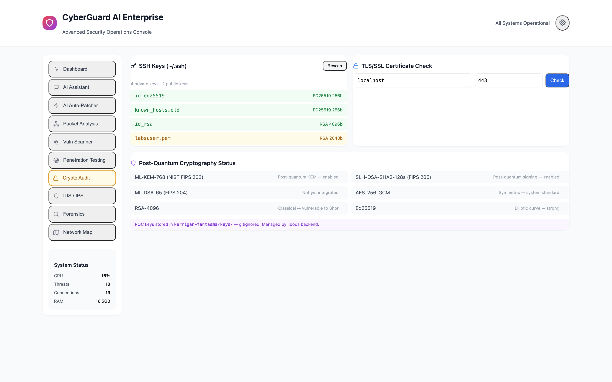
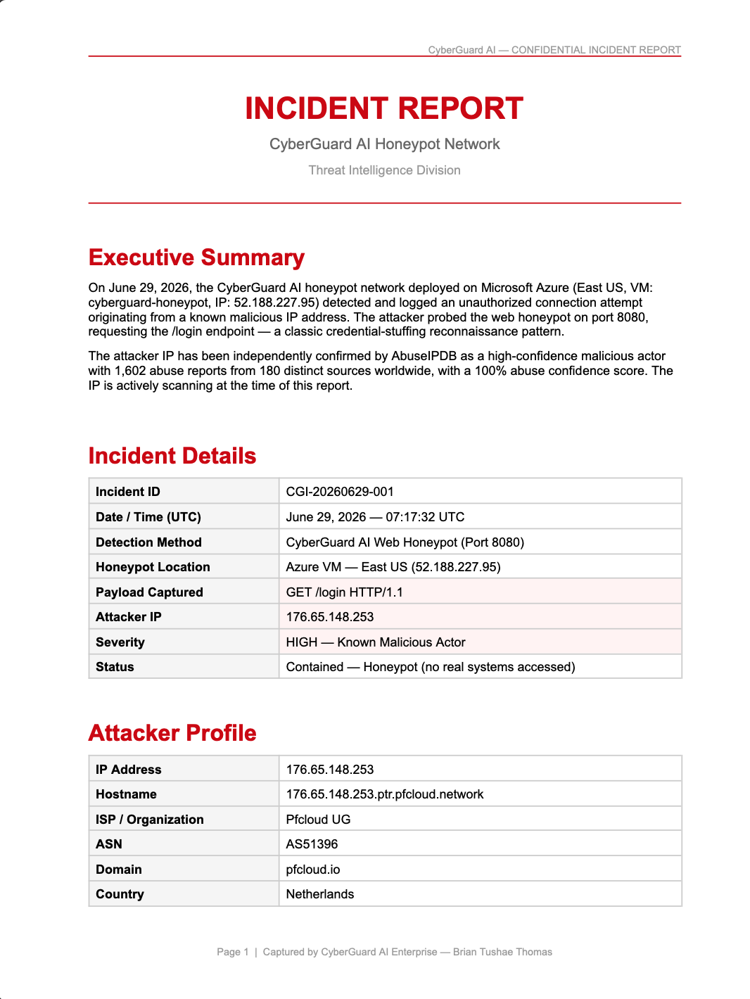

# CyberGuard AI

**Enterprise-grade AI security console for macOS — built by Brian Tushae Thomas**

A standalone Electron desktop app that combines real-time system monitoring, AI-powered threat analysis, vulnerability scanning, and digital forensics into a single elegant interface. Powered by [Kerrigan-Fantasma](https://github.com/TushaeBXN/kerrigan-fantasma) — a custom fine-tuned security AI.

---

## What It Does

| Module | Capability |
|---|---|
| **Dashboard** | Live CPU, RAM, Net I/O, threat count, security check status |
| **AI Assistant** | Chat with Kerrigan AI — answers questions about *your actual machine* using live telemetry |
| **AI Auto-Patcher** | Multi-agent fuzzing system (7 agents) — finds and patches vulnerabilities autonomously |
| **Packet Analysis** | Live network connection monitor with process attribution |
| **Vuln Scanner** | CVE scanning, IP reputation, URL checking, breach detection |
| **Penetration Testing** | SQL injection, XSS, brute force testing against local services |
| **Crypto Audit** | PQC key status (ML-KEM-768, SLH-DSA), certificate tracking, weak password detection |
| **IDS / IPS** | Real-time threat detection, honeypot activity, adaptive defense rules |
| **Forensics** | Live process inspector with kill capability, threat attribution, distillation attack detection |
| **Network Map** | Device discovery, topology visualization, open port mapping |

---

## Screenshots

**Dashboard** — live CPU, RAM, threat count, and security checks running against a 2013 MacBook Pro on macOS Sequoia via OpenCore Legacy Patcher.



**AI Assistant** — Kerrigan answering about the actual machine using live telemetry (CPU%, RAM, top processes, open ports, active threats).




**AI Auto-Patcher** — 7-agent fuzzing system: 6,499 training examples, 2 crashes found, Overmind safety gate active.



**Vuln Scanner** — Live security checks (Firewall, FileVault, SIP, Gatekeeper) + NVD CVE database search + AI Threat Hunter.



**Crypto Audit** — Real SSH key scan from `~/.ssh/`, TLS/SSL checker, and Post-Quantum Cryptography status (ML-KEM-768, SLH-DSA via liboqs).



**Incident Report** — Auto-generated threat intelligence report for the first real attacker caught by the honeypot (176.65.148.253, Netherlands, 100% AbuseIPDB confidence).



---

## Live Threat Log

The honeypot has been live since June 29, 2026. Real attackers caught so far:

| Date | Attackers | Combined Reports |
|---|---|---|
| June 29, 2026 | 5 confirmed | 8,728 AbuseIPDB reports from 1,784 sources |

**[View full threat log →](incidents/THREAT_LOG.md)**

Full incident reports (DOCX) with attacker profiles, captured payloads, CVE mappings, and global attack timelines are in the [`incidents/`](incidents/) directory.

---

## Requirements

- macOS 10.15+
- Node.js 18+
- Python 3.9+
- [Ollama](https://ollama.ai) (for AI chat)
- MySQL 8+ (for persistent memory — optional but recommended)
- [Kerrigan-Fantasma](https://github.com/TushaeBXN/kerrigan-fantasma) cloned to `~/Desktop/kerrigan-fantasma`

---

## Installation

```bash
# 1. Clone the repo
git clone https://github.com/TushaeBXN/cyberguard.git
cd cyberguard

# 2. Install Node dependencies
npm install

# 3. Install Python dependencies
pip3 install fastapi uvicorn ollama mysql-connector-python python-dotenv

# 4. Pull the AI model
ollama pull deepseek-coder:6.7b

# 5. Configure database (optional)
cp .env.example .env
# Edit .env with your MySQL credentials
```

---

## Configuration

Create a `.env` file in the project root:

```env
DB_HOST=127.0.0.1
DB_PORT=3306
DB_USER=root
DB_PASS=your_mysql_password
DB_NAME=kerrigan_db
```

The app runs fully without MySQL — it just won't persist conversations or memories to the database.

Set the path to your Kerrigan-Fantasma installation:

```bash
export KERRIGAN_PATH=~/Desktop/kerrigan-fantasma
```

Or it defaults to `~/Desktop/kerrigan-fantasma` automatically.

---

## Startup

Four terminals required for full operation:

```bash
# Terminal 1 — Ollama (AI engine)
ollama serve

# Terminal 2 — Kerrigan FastAPI server
cd ~/CyberGuardAI && python3 src/kerrigan_server.py

# Terminal 3 — SSH tunnel to Azure VM (keeps honeypot DB connected)
# Note: Azure sshd requires GatewayPorts yes in /etc/ssh/sshd_config (already configured)
ssh -i ~/Desktop/cyberguard-honeypot_key.pem -R 3306:localhost:3306 -N azureuser@52.188.227.95

# Terminal 4 — CyberGuard AI Electron app
cd ~/CyberGuardAI && npm start
```

**Azure VM honeypot** (separate SSH session — keeps internet-facing honeypots running):

```bash
ssh -i ~/Desktop/cyberguard-honeypot_key.pem azureuser@52.188.227.95
python3 ~/honeypot.py
```

The Azure VM (`52.188.227.95`) runs honeypots exposed to the open internet on ports 2222 (SSH), 8080 (Web), and 3307 (fake MySQL). Hits tunnel back to `kerrigan_db` on the local machine via reverse SSH port forwarding, appear live in the IDS/IPS panel, and trigger toast notifications in the app.

That's it. The app launches, starts all monitors, connects to Kerrigan, and begins real-time analysis automatically.

---

## Quick Reference

| Task | Command |
|---|---|
| Start Ollama | `ollama serve` |
| Start app | `cd ~/cyberguard && npm start` |
| Build DMG installer | `npm run dist` |
| Check installed models | `ollama list` |
| Pull a new model | `ollama pull <model-name>` |
| View DB in GUI | Open Querious → kerrigan_db |

---

## Architecture

```
cyberguard/
├── incidents/               # Real attacker incident reports (DOCX)
├── src/
│   ├── main.js              # Electron main process — IPC handlers, monitors, system stats
│   ├── preload.js           # Secure IPC bridge (contextIsolation)
│   ├── index.html           # Full React UI (Babel standalone, no bundler)
│   ├── kerrigan-bridge.js   # HTTP client to Kerrigan FastAPI server
│   ├── kerrigan_server.py   # FastAPI backend — chat, hunt, DB endpoints
│   ├── feeds.js             # Threat intelligence feed aggregator
│   ├── store.js             # Encrypted local credential store
│   ├── data/
│   │   └── adaptive_defense.jsonl  # Attack rules written by AdaptiveDefense engine
│   ├── monitors/
│   │   ├── connections.js   # Live TCP/UDP connection monitor
│   │   ├── ports.js         # Open port scanner
│   │   └── auth.js          # Auth event monitor
│   ├── scanners/
│   │   ├── breach-check.js  # HaveIBeenPwned integration
│   │   ├── ip-reputation.js # IP reputation lookup
│   │   ├── url-check.js     # URL safety check
│   │   └── file-scan.js     # File hash scanning
│   └── vendor/
│       ├── react.min.js     # React 18 (UMD)
│       ├── react-dom.min.js # ReactDOM 18 (UMD)
│       ├── babel.min.js     # @babel/standalone v7 for JSX
│       └── cyberguard.css   # Hand-written utility CSS (no Tailwind runtime needed)
└── package.json
```

---

## AI Integration — Kerrigan-Fantasma

CyberGuard AI is the interface layer. [Kerrigan-Fantasma](https://github.com/TushaeBXN/kerrigan-fantasma) is the AI brain:

- **Model**: `deepseek-coder:6.7b` via Ollama (upgradeable to any Ollama model)
- **Live context**: Every chat message includes your real-time CPU, RAM, open ports, active threats, and security check results — Kerrigan answers about *your specific machine*
- **Memory**: Conversations stored to `kerrigan_db.conversations` and `kerrigan_db.memories` in MySQL
- **Safety gate**: Overmind blocks live weaponization on all output paths
- **Fuzzer**: 7-agent collaborative fuzzer finds and patches vulnerabilities autonomously
- **PQC**: Post-quantum cryptography via liboqs (ML-KEM-768, SLH-DSA-SHA2-128)
- **Adaptive defense**: Learns attack patterns in real time, writes blocking rules to `adaptive_defense.jsonl`

### Upgrading the AI model

```bash
# Pull a better model
ollama pull kerrigan-fantasma:latest

# Update kerrigan_server.py
_model = "kerrigan-fantasma:latest"  # line 49
```

---

## Database Schema (kerrigan_db)

| Table | Contents |
|---|---|
| `conversations` | Every chat message and reply with timestamps |
| `memories` | Q&A pairs stored for future context recall |
| `crashes` | Vulnerabilities found by the fuzzer |
| `sessions` | Fuzzing/training session records |
| `instruct_pairs` | Training data generated during use |
| `corpus_sources` | Data sources pulled for training |

All visible in the **AI Assistant → Memories / Crashes / Sessions** tabs inside the app.

---

## Security Notes

- All processing is local — no data leaves your machine
- `.env` is gitignored — never commit credentials
- Electron runs with `contextIsolation: true` and `nodeIntegration: false`
- Overmind safety gate blocks weaponized output on all AI paths
- For educational and authorized security research only — see [USE_POLICY.md](USE_POLICY.md)

---

## What's Real

Every module shows live data — nothing is hardcoded or faked:

| Module | Real Data Source |
|---|---|
| **Dashboard** | `systeminformation` npm package — live CPU, RAM, net I/O |
| **AI Assistant** | Ollama (`deepseek-coder:6.7b`) with live system telemetry injected per message |
| **AI Auto-Patcher** | Live counts from `kerrigan_db.crashes`, `sessions`, `data/stage4/` files |
| **Packet Analysis** | Live `netstat`/`lsof` connections with process attribution |
| **Vuln Scanner** | Real port scan (asyncio sockets) + NVD CVE API + Kerrigan file threat hunt |
| **Penetration Testing** | Real port scan, real HTTP header analysis, real TLS/SSL check via `openssl`, real SSH key audit |
| **Crypto Audit** | Real `~/.ssh/` key scan via `ssh-keygen -l`, real TLS check, live PQC status |
| **IDS / IPS** | Real asyncio honeypots on ports 2222/8080/3307 logging to `kerrigan_db.honeypot_events` |
| **Forensics** | Live process table via `psutil` with kill capability |
| **Network Map** | Real `arp -a` neighbor discovery + real `netstat -rn` routing table |

## Roadmap

- [ ] Switch default model to trained `kerrigan-fantasma` after RunPod training
- [ ] DMG installer with auto-updater
- [ ] AbuseIPDB API integration for automated attacker reputation scoring
- [ ] Compliance reporting (ISO 27001, NIST CSF, HIPAA, GDPR)
- [ ] Windows and Linux builds

---

## Built By

**Brian Tushae Thomas** — creator of [Kerrigan-Fantasma](https://github.com/TushaeBXN/kerrigan-fantasma), a custom Thought-Token Bifurcated Recurrent Transformer security AI.

---

## License

MIT — see [LICENSE](LICENSE) for details.
Use governed by [USE_POLICY.md](USE_POLICY.md).
